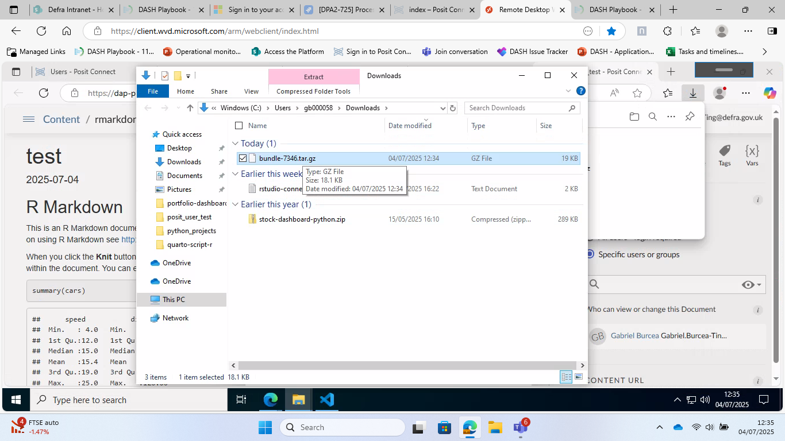

```{r setup, include=FALSE}
knitr::opts_chunk$set(echo = TRUE)
```

## Introduction

This guideline purpose is to aid the migration of the apps from old Posit Connect to new Posit Connect. The documents draws on Assumptions, Methods and actual Steps in Deploying an app from old Connect to new Connect. Moreover, there are 2 methods to deploy 

### Assumptions 

There are different assumptions: 

1. Firstly, it is assumed the R versions the app was created is reflected with the new environment. Otherwise, code has to be re-factored if there is no synchronization between the R version in the old environment with the new R Version in Workbench. The same applies to Python and Quarto. The versions of each software in the new environment are:

R's= "4.4.2" "4.4.0" "4.3.2" "4.2.2"

Python's= "3.12.3" "3.11.11" "3.10.12"

Quarto's="1.7.31" "1.6.42" "1.5.54"


Secondly, a user either is the owner of the app it plans to migrate or having the admin rights under the app. 

Thirdly,users need to be within AVD to be able to undertake the tasks needed for deployment.
 
## Scenarion 1 - Downloading the app as a bundle and redeployment 

Steps are: 

1. Inside of the app choose the 3 dots. 

2. Then select Source Version 

NOTE: You have to be on to old Posit Connect. 
```{r old-connect, echo=FALSE, out.width = '100%'}


```

3. Select download - left corner down

```{r old-connect-2, echo=FALSE, out.width = '100%'}


```


4. Unzip the bundle. And save it on preferred location with immediate accessibility. 

```{r old-connect-3, echo=FALSE, out.width = '100%'}



```


5. Open a WinSCP within AVD. Any user will have one, otherwise reach the appointed administrator to help you get one installed. 
 
6. Add New Site - in the Host Server add https://dash-workbench-dev.azure.defra.cloud

7. Press SAVE (without adding your credentials yet) and it should appear the new Workspace with the above link. 


```{r , echo=FALSE, out.width = '100%'}


```

8. Open the New Workspace - and add your defra credentials


```{r , echo=FALSE, out.width = '100%'}


```

9. Press Continue 

```{r , echo=FALSE, out.width = '100%'}


```


10. Type in your defra credential -  password

```{r , echo=FALSE, out.width = '100%'}


```


11. At this stage, on your left hand side of the panel, you are on AVD (might be Desktop). Make sure you navigate to where your RStudio project bundle/project is. You would have unziped the bundle at this stage. Then select the project folder and move it within the home directory within Workbench, on the right hand side of the panel. I have already moved my folder before hand (connect_deployment can be seen on the right hand side of the panel). 

```{r , echo=FALSE, out.width = '100%'}


```


12. Open the workbench https://dash-workbench-dev.azure.defra.cloud. Open RStudio and navigate to the home directory and check the transfer of the project. Your project is already deployed onto the RStudio Workbench.

```{r, echo=FALSE, out.width = '100%'}


```


13. Press Publish (after tested the app within new RStudio - Workbench). 

```{r old-connect-4, echo=FALSE, out.width = '100%'}


```


6. Choose Publish to Connect. 

```{r old-connect-5, echo=FALSE, out.width = '100%'}


```

7. Choose as user pleases. 

```{r old-connect-6, echo=FALSE, out.width = '100%'}


```


8. If user is doing this for the first time, then this window will be proping up.Click Next. 

```{r old-connect-7, echo=FALSE, out.width = '100%'}


```

9. Choose Posit Connect. 

```{r old-connect-8, echo=FALSE, out.width = '100%'}


```

10. Add the the url: https://dash-connect-dev.azure.defra.cloud/  . This is where the new Posit Connect resides. 

```{r old-connect-9, echo=FALSE, out.width = '100%'}


```


11. Click Next - and follow through with the next windows where user needs to Create Account. This address should be registered so that when publishing again, you won't need to follow up the procedures above. 

```{r old-connect-10, echo=FALSE, out.width = '100%'}


```

12. After creating an account - something as bellow should prop up. Press Publish. 

```{r old-connect-11, echo=FALSE, out.width = '100%'}


```


13. And finally, go to the Posit Connect - https://dash-workbench-dev.azure.defra.cloud and check under your user name the published data. It should be there. 


